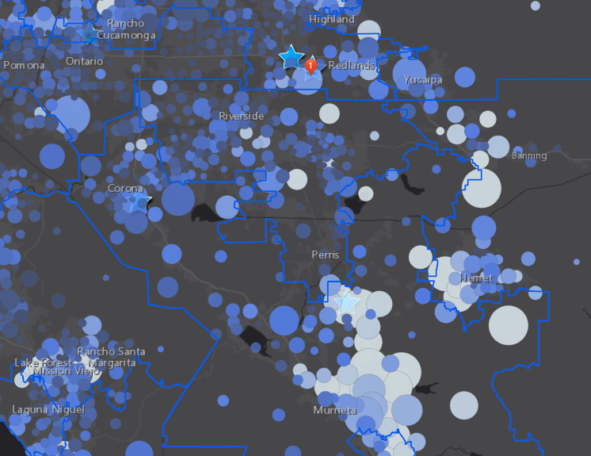

```{r}
#install.packages("readxl")
#install.packages("kableExtra")
#install.packages("ggplot2")
#install.packages("sp")
#install.packages("gghighlight")
#tinytex::install_tinytex()
```
# Veteran Overview
In general this doucment with outlines the history of VA facilities in the area, Veteran Needs and demographics, as well as the Capacity, Quality, and Accesibility of nearby CBOCs and VA Medical Centers.


# History - 
In the 1970's the current VA's were established around Riverside. Jerry Lewis, Rep for Redlands, was on the appropriations committee.

# Veteran Population and Needs in Riverside County

This data is the US census data from 2017 showing current breakdown of Veteran Population in Riverside County. We have a total of 140,000 veterans making up about 8% of the population. 

```{r pressure, echo=FALSE, fig.cap="Veterans in Riverside County", out.width = '100%'}

```


```{r echo=FALSE, fig.cap="Veterans in Riverside County", out.width = '100%'}
knitr::include_graphics("drive time.png")
```
```{r echo=FALSE, fig.cap="Veterans in Riverside County", out.width = '100%'}

```
```{r echo=FALSE, fig.cap="Veterans in Riverside County", out.width = '100%'}
knitr::include_graphics("Poverty_vet.png")
```
```{r echo=FALSE, fig.cap="Veterans in Riverside County", out.width = '100%'}

```

```{r, echo=FALSE, fig.cap="Veterans in Riverside County", out.width = '100%'}
knitr::include_graphics("legend.png")
```

```{r echo=FALSE, message=FALSE, warning=FALSE}
library(readxl)
library(kableExtra)
library(ggplot2)
VetOver <- read_excel("Data.xlsx", sheet = "Vet_census", 
    range = "A1:B6")
VetOver <- as.data.frame(VetOver)

VetOver %>%
  kable() %>%
  kable_styling(bootstrap_options = c("striped", "hover"))

colnames(VetOver) <- c("Category", "Number")

ggplot(data=VetOver, aes(x=VetOver$Category, y=VetOver$Number, fill=Category)) + geom_bar(stat="identity") + theme(legend.position = "none", axis.text.x = element_text(angle = 90)) + ylab("Number of Veterans") + xlab("")


```
```{r echo=FALSE, message=FALSE, warning=FALSE}
library(readxl)
library(kableExtra)
library(ggplot2)
library(reshape2)
library(sp)
library(gghighlight)

income <- read_excel("Data.xlsx", sheet = "B21007")
income <- as.data.frame(income)

table = income %>%
  kable() %>%
  kable_styling(bootstrap_options = c("striped", "hover"))

```


```{r echo=FALSE, message=FALSE, warning=FALSE}
table
```

```{r}
library(readxl)
library(kableExtra)
library(ggplot2)
library(reshape2)
library(sp)
library(gghighlight)

income <- read_excel("Data.xlsx", sheet = "B21007")
income <- as.data.frame(income)

income.m <- melt(income, id = c("Age", "Disability", "Location", "Percent Affected", "Error"))


dodge=position_dodge(width=0)
p1 <- ggplot(income.m, aes(x=Location, y=income.m$`Percent Affected`, color=Age, shape=Disability)) +
  geom_point(alpha=0.9, position=dodge) + ylab("Percent of District Affected") + coord_flip()  + ggtitle("All Data")  #+ geom_errorbar(position=dodge, aes(ymin=Population-income.m$`Margin of Error`, ymax=Population+income.m$`Margin of Error`), width=.1)
  


# subset data and create new object based on column query

str(income.m$Disability)
income.dis <- income.m[income.m$Disability == "With a disability" ,]

p2 <- ggplot(income.dis, aes(x=Location, y=income.dis$`Percent Affected`, color=Age)) +
  geom_point(alpha=0.9, position=dodge) + ylab("Percent of District Affected") + coord_flip() + ggtitle("Disabled Veterans Below Poverty Line")


str(income.m$Age)
income.old <- income.m[income.m$Age == "65+ years" ,]

p3 <- ggplot(income.old, aes(x=Location, y=income.old$`Percent Affected`)) +
  geom_bar(stat= "identity", fill="mediumorchid1") + ylab("Percent of District Affected") + coord_flip() + ggtitle("Senior Veterans Below Poverty Line")

str(income.m$Location)
income.here <- income.m[income.m$Location == "Congressional District 41" ,]

p4 <- ggplot(income.here, aes(x=Age, y=income.here$`Percent Affected`, fill=Disability)) +
  geom_bar(stat="identity") + ylab("Percent of District Affected")  + ggtitle("District 41") 

p1
p2
p3
p4

pdf("demos.pdf")
# set plot so it is 2x2 in one plot canvas
par(mfrow=c(2,2)) 
p1
p2
p3
p4
dev.off()

```
--A trend that it may be increasing. Show a figure of vet population over time. 

# VA Capacity

Capacity -  VA health care locations compared to demographics, kinds of care/specialties
  outpaitent services
  number of patients
  Mental Health
  Community based clinics are based on Health Centers
  Trajectory of capacity
  Ecancer
  telemedicine
  
# VA Clinic Quality

This is VA data for VA clinics in California

```{r echo=FALSE, message=FALSE, warning=FALSE}
library(readxl)
library(kableExtra)
library(ggplot2)

Wait <- read_excel("Data.xlsx", sheet = "VA_waittimes")
Wait <- as.data.frame(Wait[,3:18])
#Wait%>%
  #kable() %>%
  #kable_styling(bootstrap_options = c("striped", "hover"))

ggplot(data=Wait, aes(x=Wait$Location, y=Wait$`PC Avg Wait Time in Days 13`, fill=Wait$Location)) + geom_bar(stat="identity") + theme(legend.position = "none", axis.text.x = element_text(angle = 90)) + ylab("Primary Care Wait time (days)") + xlab("")

```

Quality - Complaint data, Ratings, Long beach data from Gerry, Takano may be able to get data for 
  $600 per patient, cost of patient is actualy \$200


This VA data focuses on quality rating of Medical Centers in California. 

```{r, echo=FALSE, message=FALSE, warning=FALSE}
library(readxl)
library(ggplot2)
library(reshape2)
data <- read_excel("Data.xlsx", sheet = "LomaLinda_rating_va", range = "A1:W9")

data.long <- melt(data, id = "Facility", measure = c("F1",	"F2",	"F3",	"F4",	"F5",	"F6",	"F7",	"F8",	"F9",	"F10",	"F11",	"F12",	"F13",	"F14",	"F15",	"F16",	"F17",	"F18",	"F19",	"F20",	"F21",	"F22"))

plot <- ggplot(data.long, aes(Facility, value, color=variable)) + geom_point(stat='identity') + theme(axis.text.x = element_text(angle = 90))

plot

pdf("Loma_linda_Rating.pdf")
plot
dev.off()
```

As a reference for these data points:

```{r, echo=FALSE}
Codes <- read_excel("Data.xlsx", sheet = "LomaLinda_rating_va", 
    range = "C12:D34")
Codes <- as.data.frame(Codes)

Codes %>%
  kable() %>%
  kable_styling(bootstrap_options = c("striped", "hover"))

```

# VA Accessiblity 

Waittimes, transportation/drive times, San bernadino,


# Conclusion:
Students here for UCR for veterans. Major bus route, 91, 215.


Ideal outcome: Winning contract for 5 CBOCs, over building one here. RFP
Hybrid, community owned, Va owned. CBOCs are lucrative

# To Do:
Learn more about Arcadia location that just opened- Nepalitono, june, shift, their case for clinic - provides access to those without a car. 

Email Ignacio about getting VA rank and branch info for va clinics so we can look at the needs of each branch and what will be needed here as far as services go. 

