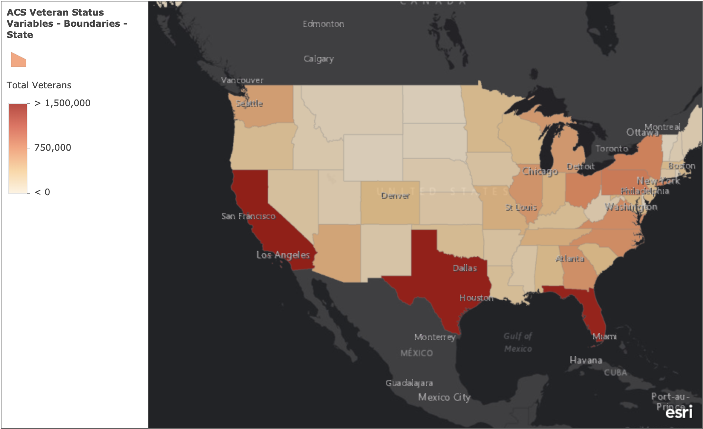
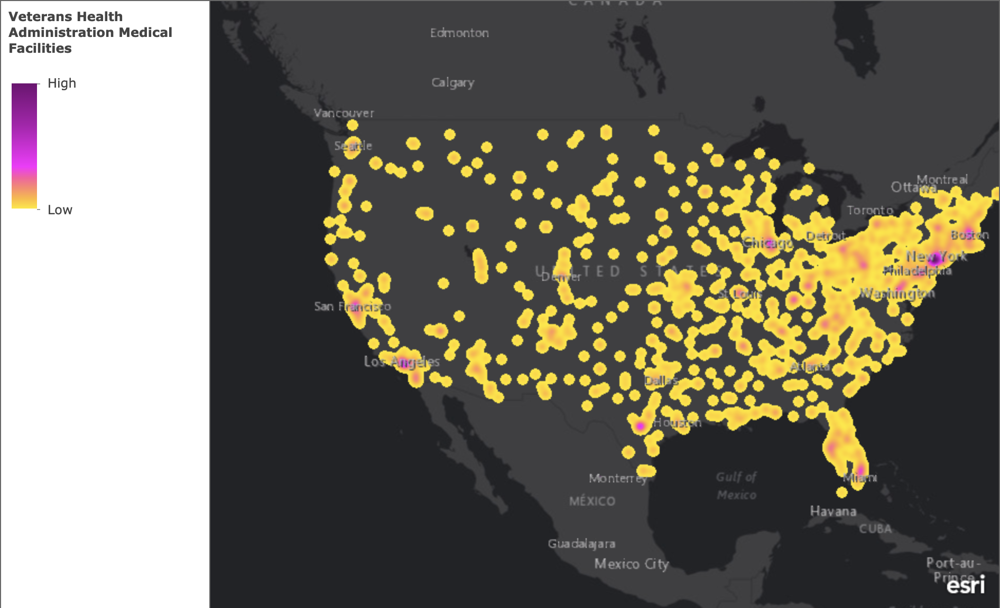
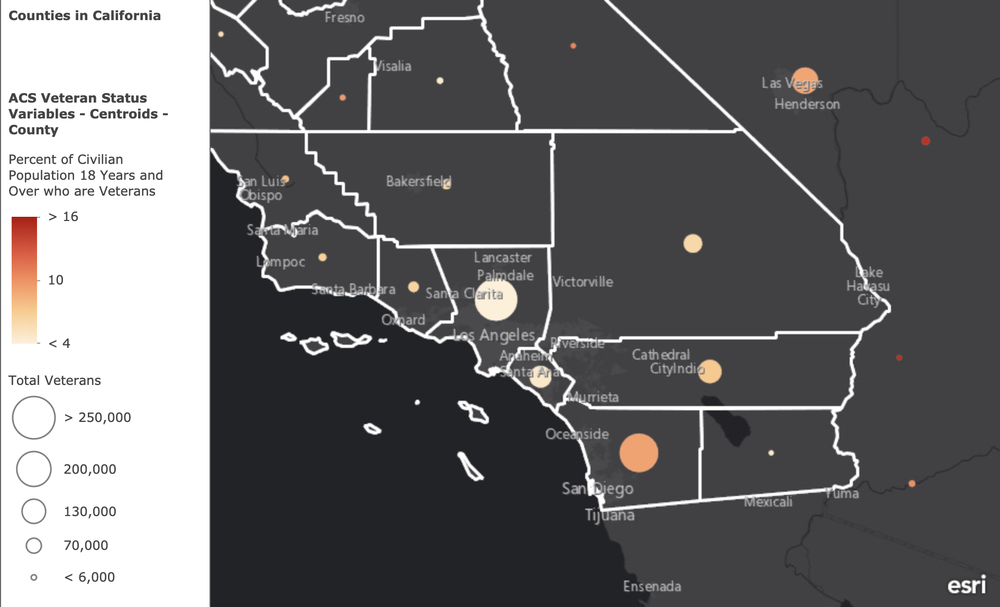
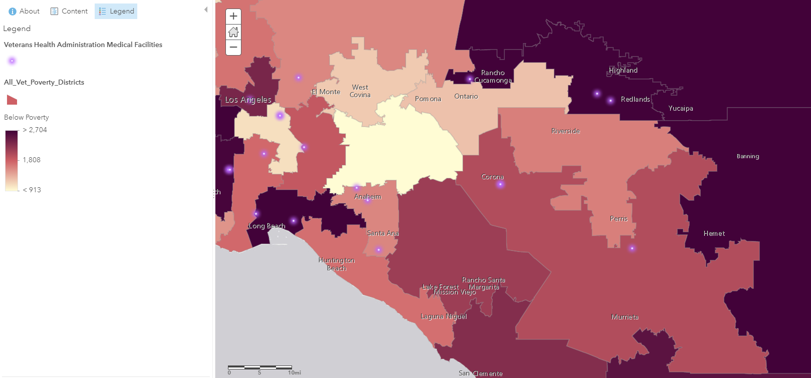
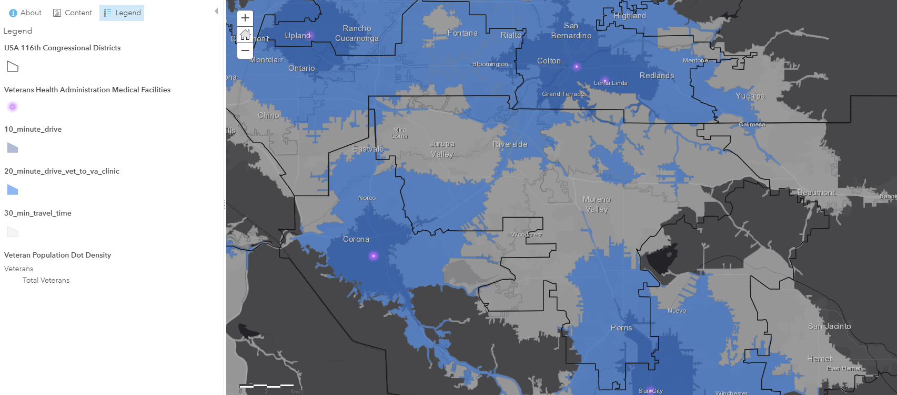
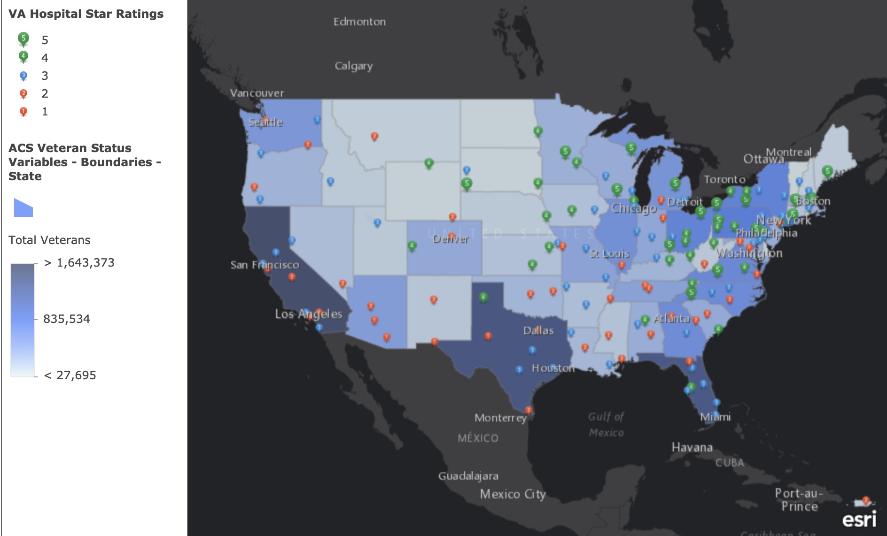

```{r echo=FALSE}
#install.packages("readxl")
#install.packages("kableExtra")
#install.packages("ggplot2")
#install.packages("sp")
#install.packages("gghighlight")
#tinytex::install_tinytex()
```
# Veteran Overview
In general this doucment with outlines the history of VA facilities in the area, Veteran Needs and demographics, as well as the Capacity, Quality, and Accesibility of nearby CBOCs and VA Medical Centers.

Dispite having a high population of veterans California does not have A.) High Quality VA Clinics B.) Or Clinics that are accessible by much of the population
 (See figures below)

```{r pressure, echo=FALSE, fig.cap="Veterans in Riverside County", out.width = '50%', fig.cap="A.) This figure shows veterans populations in california are the highest"}


#change district border and Clinic Color
```

```{r echo=FALSE, out.width = '50%', fig.cap="B.) Blobs dot denoting locations within reach of VA Clinics show that there is a lack of clinics in high population areas like california"}



#change district border and Clinic Color
```

## Southern California

Much of the population of veterans resides farther east than where clinics are located

```{r echo=FALSE, out.width = '100%', fig.cap="Southern California has  a high population of Veterans"}


#change district border and Clinic Color
```

# History - 
In the 1970's the current VA's were established around Riverside. Jerry Lewis, Rep for Redlands, was on the appropriations committee. Now as desert community populations are growing there is a need for clinics further east.


# Veteran Population and Needs in Riverside County

This data is the US census data from 2015 to 2017 showing current breakdown of Veteran Population in Riverside County. We have a total of 140,000 veterans making up about 8% of the population. Curretnly there is no VA clinic in Riverside and the nearest one in Corona is about a two hour bus ride.


```{r echo=FALSE, message=FALSE, warning=FALSE}
library(readxl)
library(kableExtra)
library(ggplot2)
VetOver <- read_excel("Data.xlsx", sheet = "Vet_census", 
    range = "A1:E7")
VetOver <- as.data.frame(VetOver)

VetOver %>%
  kable() %>%
  kable_styling(bootstrap_options = c("striped", "hover"))

colnames(VetOver) <- c("Gender", "Year", "Population", "SE")

VetPop.plot <- ggplot(data=VetOver, aes(x=VetOver$Year, y=VetOver$Population, fill=Gender)) + ylab("Number of Veterans") + xlab("") + geom_bar(stat="identity") + labs(title="Riverside County Veteran Population") + geom_errorbar(aes(ymin=Population-SE, ymax=Population+SE), width=.1) +ylim(0, 150000)


#Increasing homeless counts

```

```{r figs, echo=FALSE, fig.width=4,fig.height=4,fig.cap="this figure shows the population of Veterans in Riverside county over the course of three years, although we see a decrease year after years, homeless veteran populations are increasing"}
VetPop.plot
```

```{r echo=FALSE, message=FALSE, warning=FALSE}
library(readxl)
library(kableExtra)
library(ggplot2)
library(reshape2)
library(sp)
library(gghighlight)

income <- read_excel("Data.xlsx", sheet = "B21007")
income <- as.data.frame(income)

income.m <- melt(income, id = c("Age", "Disability", "Location", "Population", "Error"))


dodge=position_dodge(width=0)
#p1 <- ggplot(income.m, aes(x=Location, y=income.m$`Percent Affected`, color=Age, shape=Disability)) +
#  geom_point(alpha=0.9, position=dodge) + ylab("Percent of District Affected") + coord_flip()  + ggtitle("All Data")  #+ geom_errorbar(position=dodge, aes(ymin=Population-income.m$`Margin of Error`, ymax=Population+income.m$`Margin of Error`), width=.1)
  


# subset data and create new object based on column query

#str(income.m$Disability)
#income.dis <- income.m[income.m$Disability == "With a disability" ,]

#p2 <- ggplot(income.dis, aes(x=Location, y=income.dis$`Percent Affected`, color=Age)) +
 # geom_point(alpha=0.9, position=dodge) + ylab("Percent of District Affected") + coord_flip() + ggtitle("Disabled Veterans Below Poverty Line")


str(income.m$Age)
income.old <- income.m[income.m$Age == "65+ years" ,]

p3 <- ggplot(income.old, aes(x=Location, y=income.old$`Population`)) +
  geom_bar(stat= "identity", fill="mediumorchid1") + ylab("Individuals") + coord_flip() + ggtitle("Senior Veterans Below Poverty Line")

#str(income.m$Location)
#income.here <- income.m[income.m$Location == "Congressional District 41" ,]

#p4 <- ggplot(income.here, aes(x=Age, y=income.here$`Population`, fill=Disability)) + geom_bar(stat="identity") + ylab("Individuals")  + ggtitle("District 41") 

#p1
#p2


pdf("demos.pdf")
# set plot so it is 2x2 in one plot canvas
par(mfrow=c(1,1)) 
#p1
#p2
p3
dev.off()

```

Of the 140,000 Veterans in Riverside county thousands live below the poverty line (See districts 42 and 41). Meaning they may rely on public transporation to get them to VA clinics. 

```{r echo=FALSE, fig.width=4,fig.height=4,fig.cap="This figure shows senior veterans (65+ years old) living below the poverty line in California Congressional Districts"}
p3
```

Here is a specific break down of veterans with disablities that might inhibit them from being able to drive a car. 

```{r echo=FALSE, message=FALSE, warning=FALSE}
library(readxl)
library(ggplot2)
library(reshape2)

dis <- read_excel("Data.xlsx", sheet = "B21100", range = "A1:M3")
dis.df <- as.data.frame(dis)

dis.m <- melt(dis.df, id = c("Geography"))

p4 <- ggplot(dis.m, aes(x=Geography, y=value, fill=variable)) +
  geom_bar(stat="identity", position = position_dodge()) + ylab("Individuals")  + ggtitle("Disablable Veteran Population in Southern California") + theme(axis.text.x = element_text(angle = 90))


```

```{r echo=FALSE, fig.width=8,fig.height=6,fig.cap="This figure shows veterans with and without disablilities living below the poverty line in California Congressional District 41"}
p4
```


## Mental Health in Riverside CA
  I'd like to include some data on veteran mental health health here. it would demonstrate the need for a loca facility but also help define what might be key roles for a new clinic. 

# VA Accessiblity 

Transportation/drive times

```{r echo=FALSE, fig.cap="Veteran Poverty in Surrounding Congressional Districts", out.width = '100%'}

```

```{r echo=FALSE, fig.cap="Drive times to Clinics in Southern California", out.width = '100%'}



```

## Mobile Clinic Route

Potential figure here showing routes that would benfit many veterans isolated by distance to a clinic


```{r echo=FALSE, message=FALSE, warning=FALSE}
library(readxl)
library(kableExtra)
library(ggplot2)
library(reshape2)
library(sp)
library(gghighlight)

income <- read_excel("Data.xlsx", sheet = "B21007")
income <- as.data.frame(income)

table = income %>%
  kable() %>%
  kable_styling(bootstrap_options = c("striped", "hover"))

```


```{r echo=FALSE, message=FALSE, warning=FALSE}
table
```


--A trend that it may be increasing. Show a figure of vet population over time. 

# VA Capacity

Capacity -  VA health care locations compared to demographics, kinds of care/specialties
  outpaitent services
  number of patients
  Mental Health
  Community based clinics are based on Health Centers
  Trajectory of capacity
  Ecancer
  telemedicine
  
# VA Clinic Quality

This is VA data for VA clinics in California
```{r echo=FALSE, fig.cap="Veterans Populations and Medical Center Ratings", out.width = '100%'}

```


```{r echo=FALSE, message=FALSE, warning=FALSE}
library(readxl)
library(kableExtra)
library(ggplot2)

Wait <- read_excel("Data.xlsx", sheet = "VA_waittimes")
Wait <- as.data.frame(Wait[,3:18])
#Wait%>%
  #kable() %>%
  #kable_styling(bootstrap_options = c("striped", "hover"))

p5 <- ggplot(data=Wait, aes(x=Wait$Location, y=Wait$`PC Avg Wait Time in Days 13`, fill=Wait$Location)) + geom_bar(stat="identity") + theme(legend.position = "none", axis.text.x = element_text(angle = 90)) + ylab("Primary Care Wait time (days)") + xlab("")

```
```{r echo=FALSE, fig.width=4,fig.height=4,fig.cap="Average wait times at clinics around California"}
p5
```


```{r, echo=FALSE, message=FALSE, warning=FALSE}
library(readxl)
library(ggplot2)
library(reshape2)
data <- read_excel("Data.xlsx", sheet = "VA sqft v Patients", range = "A1:C6")

data.long <- melt(data, id = c("Location", "Patients", "Space"))

p6 <- ggplot(data.long, aes(Location, Patients, fill=Space)) + geom_bar(stat = "identity") + theme(axis.text.x = element_text(angle = 90))


pdf("Loma_linda_Rating.pdf")
p6
dev.off()

#Include age over time of each of these facilites. 
```
```{r echo=FALSE, fig.width=4,fig.height=4,fig.cap="Loma Linda facilities capacity/size"}
p6
```


This VA data focuses on quality rating of Medical Centers in California. 

```{r echo=FALSE, message=FALSE, warning=FALSE}
library(readxl)
library(ggplot2)
library(reshape2)
data <- read_excel("Data.xlsx", sheet = "LomaLinda_rating_va", range = "A1:W9")

data.long <- melt(data, id = "Facility", measure = c("F1",	"F2",	"F3",	"F4",	"F5",	"F6",	"F7",	"F8",	"F9",	"F10",	"F11",	"F12",	"F13",	"F14",	"F15",	"F16",	"F17",	"F18",	"F19",	"F20",	"F21",	"F22"))

p7 <- ggplot(data.long, aes(Facility, value, color=variable)) + geom_point(stat='identity') + theme(axis.text.x = element_text(angle = 90))


pdf("Loma_linda_Rating.pdf")
p7
dev.off()
```
```{r echo=FALSE, fig.width=4,fig.height=4,fig.cap="Rating for various medical codes for Loma Linda medical center"}
p7
```

As a reference for these data points:

```{r, echo=FALSE, message=FALSE, warning=FALSE}
Codes <- read_excel("Data.xlsx", sheet = "LomaLinda_rating_va", 
    range = "C12:D34")
Codes <- as.data.frame(Codes)

Codes %>%
  kable() %>%
  kable_styling(bootstrap_options = c("striped", "hover"))

```


# Conclusion:
Students here for UCR for veterans. Major bus route, 91, 215.


Ideal outcome: Winning contract for 5 CBOCs, over building one here. RFP
Hybrid, community owned, Va owned. CBOCs are lucrative

# To Do:
Learn more about Arcadia location that just opened- Nepalitono, june, shift, their case for clinic - provides access to those without a car. 

Email Ignacio about getting VA rank and branch info for va clinics so we can look at the needs of each branch and what will be needed here as far as services go. 

