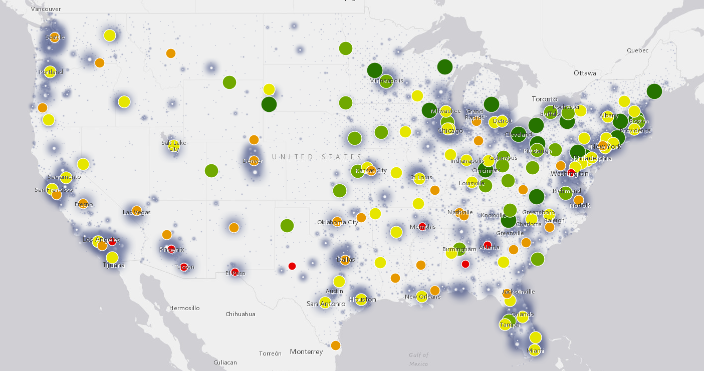
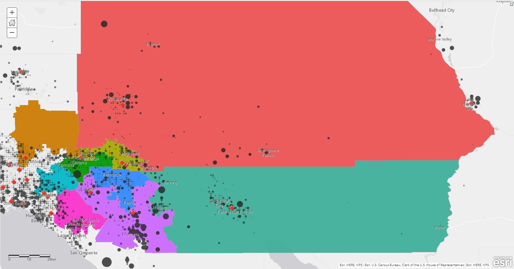

```{r global_options, include=FALSE, echo=FALSE}
#install.packages("readxl")
#install.packages("kableExtra")
#install.packages("ggplot2")
#install.packages("sp")
#install.packages("gghighlight")
#tinytex::install_tinytex()
library(readxl)
library(ggplot2)
library(reshape2)
library(knitr)
library(kableExtra)
```
Summary: with figure for socal districts

\pagebreak


# National Level


A.) This figure shows veterans populations in california are some of the highest in the nation


{width=80%}

\pagebreak


B.) Blobs dot denoting locations within reach of VA Clinics show that there is a lack of clinics in high population areas like california


{width=80%}


\pagebreak


C.) Additionally VA data shows that clinics quantity and quality decreases in the western united states


{width=80%}  {width=30%}

\pagebreak


# Southern California Veteran Overview

Much of Southern California is desert and as such has very dispersed veteran populations (figure 1). In addition there are different branches due to other geographic features such as coastal access for the Navy, air force bases, training bases. Many people (approxamately 2.6 million in the last 10 years) are moving into California including veterans [Source: World population]

## History

In 1888 the LA West Campus was gifted to the Federal Government. It was under scruteny for corruption and mismangement with lead to the creation of the "Master Plan" [Everything You Need To Know About The Massive, Decaying West LA VA Campus — And The Plan To Fix It.] bringing in more housing for Veterans and reducing the Veteran Homeless Population in LA [LA’s Veteran Homelessness down 18 Percent]. The plan also revitalizes the medical facilities however cuts the PTSD clinic [The VA Wants to Move a PTSD Clinic. The Vets Are Fighting Back].

In the 1970's the current VA's were established around Riverside. Jerry Lewis, Rep for Redlands, was on the appropriations committee. Now as desert community populations are growing there is a need for clinics further east.

## Veteran Population in Southern California

Analyzed districts include 36, 42, 41, 31, 35, 8, 27, 45, and 39 chosen based on a 10 mile distance of the perimeter of District 41. There are nearly 30,000 veterans making up about 5% of the population in District 41 alone. Currently there is no VA clinic in Riverside and the nearest one, in Corona, is about a two hour bus ride.


This analysis assigned census tracks (neighborhoods) a value of veterans and then output a circle corresponding to the number of veterans in that area. 

{width=70%} {height=25%}

\pagebreak

The next analysis used VA facilities in southern california as reference points, then using traffic data (monday 8:00) mapped out the furthest a driver could go in the given time constraints, 10min, 20min, 45min, and 1hr. The darker the area the shorter the drive to a VA clinic.


{width=80%}{height=30%}
\pagebreak

Each veteran assessed from track data was assigned to the district in which they belong. These values were summed up and are presented as high to low values (Red to Yellow)

{width=85%}{height=20%}
\pagebreak

## Demographics

This data is the US census data from 2013 to 2017 showing current breakdown of Veteran Population by Race, War Participation, and Education.


### Race

This heatmap shows various races claimed by veterans in census data, this data is overlayed onto District data. Composition of each district can be analyzed based on heat (red is high populations yellow is low)

```{r echo=FALSE, message=FALSE, warning=FALSE, include=FALSE}

demo <- read_excel("Data.xlsx", sheet = "Vet_Census_Demo")
demo.m <- melt(demo, id = c("Race",	"District",	"Veteran Total",	"Veteran Total Error"))
demo.m$District <- as.character(demo.m$District)

#demo.plot <- ggplot(demo.m, aes(x=District, y=Race, size="Veteran Total", fill="District")) + geom_jitter(aes(size = demo.m$`Veteran Total`, colour = demo.m$District), alpha=.5) + scale_size(range = c(0,5)) + theme_bw()

Demo.heat <- ggplot(demo.m, aes(demo.m$District, demo.m$Race)) + geom_tile(aes(fill = demo.m$`Veteran Total`), colour = "white") + scale_fill_gradient(low = "yellow", high = "red", name="Number of Veterans") + ylab("Race") + xlab("District")

Demo.heat

pdf("Demo.pdf", width = 7, height = 4)
  Demo.heat
dev.off

```

```{r echo=FALSE, fig.width=7,fig.height=4,fig.cap="this figure shows the population of Veterans in District 41 and surrounding districts",fig.pos = "H"}
Demo.heat
```


### War Participation


This analysis shows the various campaigns in which the veterans in southern california have been involved. 

```{r echo=FALSE, message=FALSE, warning=FALSE, include=FALSE}

War <- read_excel("Data.xlsx", sheet = "B21002", range= "A2:C11")


```


### Education

This analysis shows the degree attainment of veterans as reported to US Census bureau


## Need for Transportation to make clinics accessible 

There are approxamately 60,000 disabled vets in District 41 and surrounding Districts. Here is a specific break down of veterans with disablities, senior status, and those living below the poverty line that might inhibit them from being able to drive a car. 

```{r echo=FALSE, message=FALSE, include=FALSE}


income <- read_excel("Data.xlsx", sheet = "B21007")
income <- as.data.frame(income)

income.m <- melt(income, id = c("Age", "Disability", "District", "Population", "Margin of Error"))

# subset data and create new object based on column query
str(income.m$Disability)
income.dis <- income.m[income.m$Disability == "With a disability" ,]

dodge=position_dodge(width=.99)
p1 <- ggplot(income.dis, aes(x=District, y=income.dis$`Population`, fill=Age)) +
  geom_bar(stat="identity", alpha=0.9, position=dodge) + ylab("Number of Disabled Veterans") + geom_errorbar(position=dodge, aes(ymin=Population-income.dis$`Margin of Error`, ymax=Population+income.dis$`Margin of Error`), width=.1)


str(income.m$Age)
income.old <- income.m[income.m$Age == "65+ years" ,]

p2 <- ggplot(income.old, aes(x=District, y=income.old$`Population`, fill=income.old$District)) +
  geom_bar(stat= "identity") + ylab("Number of Veterans") + ggtitle("Senior Veterans Below Poverty Line") + theme(legend.position = "none")


pdf("demos.pdf")
p1
p2
dev.off()

```

### Disablities 

```{r echo=FALSE, message=FALSE, warning=FALSE, include=FALSE}


dis <- read_excel("Data.xlsx", sheet = "B21100")
dis.df <- as.data.frame(dis)

dis.m <- melt(dis.df, id = c("Variable",	"Percent Disability",	"District",	"Population"))

dis.plot <- ggplot() + geom_bar(aes(y = dis.df$Population, x = dis.df$`Percent Disability`, fill = dis.df$District), stat="identity") + guides(fill=guide_legend(title="Congressional District")) + ylab("Population") + xlab("Percent Service Connected Disability ")

pdf("displot.pdf", height=4, width=10)
dis.plot
dev.off()


```

This figure shows the distribution of the 60,000 disabled vets by their percent Service connected disablity


```{r echo=FALSE, fig.width=8,fig.height=6,fig.cap="This figure shows veterans with disablilities",fig.pos = "H"}
dis.plot
```

\pagebreak

This figure was analyzed using census data on veterans that indicated that their wages were below the poverty level 


```{r echo=FALSE, fig.width=8,fig.height=4,fig.cap="This figure shows disabled veterans living below the poverty line",fig.pos = "H"}
p1
```

\pagebreak


### Senior Status

This figure uses Census data and reports veterans 65 year and older. 

```{r echo=FALSE, message=FALSE, include=FALSE}


age <- read_excel("Data.xlsx", sheet = "Seniors", range = "A1:C10")
age <- as.data.frame(age)

age.plot <- ggplot(age, aes(x=age$District, y=age$`Total Seniors`, fill=age$District)) +
  geom_bar(stat="identity") + ylab("Number of Veterans over 65") + xlab("Congressional District") + geom_errorbar(aes(ymin=age$`Total Seniors`-age$Error, ymax=age$`Total Seniors`+age$Error), width=.1) + theme(legend.position = "none")


pdf("age.pdf")
age.plot
dev.off()

```


```{r echo=FALSE, fig.width=8,fig.height=4,fig.cap="This figure shows senior veterans (65+ years old) living below the poverty line", fig.pos = "H"}
age.plot
```


This is a break down of the senior veterans that live below the poverty level in each district 


```{r echo=FALSE, fig.width=8,fig.height=4,fig.cap="This figure shows senior veterans (65+ years old) living below the poverty line", fig.pos = "H"}
p2
```

\pagebreak

### Income

In district 41 and surrounding districts thousands live below the poverty line, and as a result they may rely on public transporation to get them to VA clinics. 

This result shows employed and unemployed veterans living below the poverty level
\pagebreak

```{r echo=FALSE, message=FALSE, warning=FALSE}

VetOver <- read_excel("Data.xlsx", sheet = "Vet_census_age", range = "A1:D7")
VetOver <- as.data.frame(VetOver)

VetOver %>%
  kable() %>%
  kable_styling(bootstrap_options = c("striped", "hover"))

colnames(VetOver) <- c("Gender", "Year", "Population", "SE")

VetPop.plot <- ggplot(data=VetOver, aes(x=VetOver$Year, y=VetOver$Population, fill=Gender)) + ylab("Number of Veterans") + xlab("") + geom_bar(stat="identity") + labs(title="Riverside County Veteran Population") #+ geom_errorbar(aes(ymin=Population-SE, ymax=Population+SE), width=.1) + ylim(0, 150000)

#Increasing homeless counts over time

```

```{r figs, echo=FALSE, fig.width=4,fig.height=4,fig.cap="this figure shows the population of Veterans in Riverside county over the course of three years, although we see a decrease year after years, homeless veteran populations are increasing", fig.pos = "H"}
VetPop.plot
```

\pagebreak
## Mental Health in Riverside CA
  I'd like to include some data on veteran mental health health here. it would demonstrate the need for a loca facility but also help define what might be key roles for a new clinic. 
  


## Mobile Clinic Route

Potential figure here showing routes that would benfit many veterans isolated by distance to a clinic


```{r echo=FALSE, message=FALSE, warning=FALSE}
library(readxl)
library(kableExtra)
library(ggplot2)
library(reshape2)
library(sp)
library(gghighlight)

income <- read_excel("Data.xlsx", sheet = "B21007")
income <- as.data.frame(income)

table = income %>%
  kable() %>%
  kable_styling(bootstrap_options = c("striped", "hover"))

```


```{r echo=FALSE, message=FALSE, warning=FALSE, fig.pos = "H"}
#table
```


--A trend that it may be increasing. Show a figure of vet population over time. 

## Patient to Area Ratios

#```{r echo=FALSE, message=FALSE, include=FALSE}
library(readxl)
library(ggplot2)
library(reshape2)
data <- read_excel("Data.xlsx", sheet = "VA sqft v Patients", range = "A1:C6")

data.long <- melt(data, id = c("Location", "Patients", "Space"))

p6 <- ggplot(data.long, aes(Space, Patients)) + geom_point(aes(color=factor(data.long$Location)), size = 5) + labs(color = "Facility") + theme(legend.title = element_text("Facility")) + scale_size_area(max_size = 6) 

pdf("Loma_Linda_Rating.pdf")
p6
dev.off()

#Include age over time of each of these facilites. 
```

#```{r echo=FALSE, fig.width=8,fig.height=4,fig.cap="Loma Linda facilities capacity/size", fig.pos = "H"}
p6
```
\pagebreak
## Trends over time 

\pagebreak  
## Wait times


This is VA wait time data for each VA clinic in California


```{r echo=FALSE, message=FALSE, warning=FALSE}
library(readxl)
library(kableExtra)
library(ggplot2)

Wait <- read_excel("Data.xlsx", sheet = "VA_waittimes", range = "A40:D1443")


p5 <- ggplot(data=Wait, aes(x=Wait$`PC Avg Wait Time (Days)`, y=Wait$`Completed within 30 Days 2`, fill=Wait$`PC Avg Wait Time in Days 13`, color=Wait$`PC Avg Wait Time (Days)`), label=Wait$`Completed Appointment Wait Times National,`) + geom_point(alpha=0.2, size=2) + xlab("Wait time for Primary Care (Days)") + ylab("Completed Appointments") + labs(fill="Wait time (Days)") + scale_color_continuous(low = "green", high = "red", name="Number of Veterans") + geom_text(aes(label=ifelse((Wait$`Completed within 30 Days 2` > 75000 & Wait$`PC Avg Wait Time (Days)` < 5), as.character(Wait$`Completed Appointment Wait Times National,`), " ")), position=position_jitter(width=.1,height=11))


p5
```


```{r echo=FALSE, fig.width=8,fig.height=4,fig.cap="Average wait times at clinics around California", fig.pos = "H"}
p5
```

\pagebreak
## Ratings


This VA data focuses on quality rating of Medical Centers in California. 

```{r echo=FALSE, message=FALSE, include=FALSE}
library(readxl)
library(ggplot2)
library(reshape2)
data <- read_excel("Data.xlsx", sheet = "LomaLinda_rating_va", range = "A1:W9")

data.long <- melt(data, id = "Facility")
data.long
p7 <- ggplot(data.long, aes(Facility, variable)) + geom_tile(aes(fill=data.long$value)) + theme(axis.text.x = element_text(angle = 90)) + scale_fill_gradient(low = "red", high = "green", name="Percent Quality Rating") + ylab("Procedure Code")


p7
pdf("Loma_Linda_Rating.pdf")
p7
dev.off()
```


```{r echo=FALSE, fig.width=8,fig.height=4,fig.cap="Rating for various medical codes for Loma Linda medical center", fig.pos = "H"}
p7
```
\pagebreak

As a reference for these data points:

```{r, echo=FALSE, message=FALSE, warning=FALSE,fig.pos = "H"}
Codes <- read_excel("Data.xlsx", sheet = "LomaLinda_rating_va", 
    range = "C12:D34")
Codes <- as.data.frame(Codes)

Codes %>%
  kable() %>%
  kable_styling(bootstrap_options = c("striped", "hover"))

```

\pagebreak

# Conclusion
Students here for UCR for veterans. Major bus route, 91, 215.


Ideal outcome: Winning contract for 5 CBOCs, over building one here. RFP
Hybrid, community owned, Va owned. CBOCs are lucrative


# Sources
Denkmann, Libby. n.d. “Everything You Need To Know About The Massive, Decaying West LA VA Campus — And The Plan To Fix It.” LAist. Accessed August 20, 2019. https://laist.com/2018/07/10/everything_you_need_to_know_about_the_massive_decaying_west_la_va_campus_--_and_the_plan_to_fix_it.php.

Office of Policy, and Planning. n.d. “National Center for Veterans Analysis and Statistics.” Accessed August 20, 2019. https://www.va.gov/vetdata/.

Radio, Southern California Public. 2018a. “The VA Wants to Move a PTSD Clinic. The Vets Are Fighting Back.” Southern California Public Radio. April 26, 2018. https://www.scpr.org/news/2018/04/26/82584/the-va-plans-to-move-a-ptsd-clinic-in-west-la-thes/.

———. 2018b. “LA’s Veteran Homelessness down 18 Percent.” Southern California Public Radio. May 31, 2018. https://www.scpr.org/news/2018/05/31/83625/veteran-homelessness-in-la-has-dropped-by-18-perce/.

“Report Card - Vets Advocacy.” n.d. Vets Advocacy. Accessed August 20, 2019. https://www.vatherightway.org/report-card/.

U.S. Census Bureau. 2010. “American FactFinder,” October. https://factfinder.census.gov/faces/nav/jsf/pages/index.xhtml.

“VA Facility in West Los Angeles Abandons Homeless Veterans - Lawsuit Challenges VA’s Misuse of Land Given to House Injured Vets.” 2011. ACLU of Southern California. June 8, 2011. https://www.aclusocal.org/en/press-releases/va-facility-west-los-angeles-abandons-homeless-veterans-lawsuit-challenges-vas-misuse.

VA Greater Los Angeles Healthcare System, U.S. Department of Veterans Affairs. n.d. “Master Plan to Revitalize West LA Campus - VA Greater Los Angeles Healthcare System.” Accessed August 20, 2019. https://www.losangeles.va.gov/masterplan/.


# To Do:
Learn more about Arcadia location that just opened- Nepalitono, june, shift, their case for clinic - provides access to those without a car. 

Email Ignacio about getting VA rank and branch info for va clinics so we can look at the needs of each branch and what will be needed here as far as services go. 

Get bus route data from Lorelle, 9517877141

